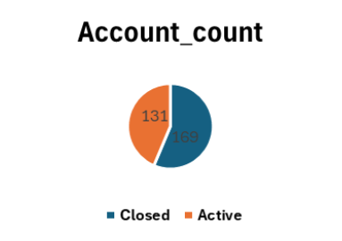

# SQL_Project_Bank_Analysis

**SQL Final Project – Datacube Bootcamp**

---

## Project Purpose  

The main purpose of this project is to analyze bank customers' account, transaction, and credit data using SQL and to evaluate customer behavior and the bank's profitability.

---

## Tables Used  

CUSTOMERS, ACCOUNTS, TRANSACTIONS, CREDIT

---

## Tasks and Results  

### I. Customer and Account Indicators  

**1. How many active accounts each customer has and the total balance amount**  
- Script: [Task 1](Scripts/Task_1.sql)  
- Chart 1:   
- Chart 2: 

---

**2. Average account balance by city**  
- Script: [Task 2](Scripts/Task_2.sql)

- Result:
  - Sumqayit is the leader in both average balance and number of transactions.  
  - Ganja and Lankaran are strong in balance but slightly behind in transaction count.  
  - Baku has the lowest average balance and transaction indicators.

---

**3. Number of accounts and balance by customer age groups**  
- Script: [Task 3](Scripts/Task_3.sql)

Result:  
  - The age groups 28–37 and 68–77 are above average.  
  - The age ranges 38–47 and 58–67 showed below-average results.
---

**4. Top 10 richest customers (Top Balance)**  
- Script: [Task 4](Scripts/Task_4.sql)  
- Chart 3: 

---

### II. Transaction Analysis  

**5. Total deposit and withdrawal amount per account**  
- Script: [Task 5](Scripts/Task_5.sql)
- Result: 
  - Total transaction amount: **3.24 million ₼**  
  - Deposits: **1.55 million ₼ (188 accounts)**  
  - Withdrawals: **1.68 million ₼ (205 accounts)**
---

**6. Number of transactions and total amount per customer**  
- Script: [Task 6](Scripts/Task_6.sql)  
- Chart 4: 
- Result:  
  - Total transaction amount: **5 million ₼**, across 155 customers.  
  - The highest transaction count is in the range of 5–8.  
  - Customers with 10+ transactions are few but stand out with high amounts.  
  - Those with 1–3 transactions make up the majority but have low-value operations.
---

**7. Accounts with the most transactions**  
- Script: [Task 7](Scripts/Task_7.sql)
- Result: 
  - Accounts with 4–5 transactions have the highest turnover (~1M ₼).  
  - Those with 1–2 transactions form the passive account group.  
  - Accounts with 6+ transactions are very few and have lower transaction amounts.
---

**8. Share of transaction types (Deposit, Withdrawal, Transfer)**  
- Script: [Task 8](Scripts/Task_8.sql)  
- Chart 5: 
- Result:  
  - Transfer – 35%  
  - Withdrawal – 34.3%  
  - Deposit – 30.7%  
  - Transfer transactions are slightly ahead of the others.

---

**9. Find each customer’s largest transaction amount and compare it with the average transaction amount**  
- Script: [Task 9](Scripts/Task_9.sql)
- Result:
  - Above Average - 13,906  
  - Below Average - 977  
  - Approximately 94% of customers’ largest transactions are above the average transaction amount.
---

### III. Time and Trend Analysis  

**10. Number and amount of transactions by month and year**  
- Script: [Task 10](Scripts/Task_10.sql)  
- Chart 6:   
- Chart 7: 

---

**11. Monthly deposit and withdrawal trend**  
- Script: [Task 11](Scripts/Task_11.sql)  
- Chart 8: 

---

### IV. Credit Analysis  

**12. Credits and total credit amount per customer**  
- Script: [Task 12](Scripts/Task_12.sql)

---

**13. Shares by credit status (Active, Closed, Defaulted)**  
- Script: [Task 13](Scripts/Task_13.sql)  
- Chart 9: 

---

**14. Average monthly credit payment per customer**  
- Script: [Task 14](Scripts/Task_14.sql)  
- Chart 10: 

---

**15. Profitability analysis by credit interest rates**  
- Script: [Task 15](Scripts/Task_15.sql)

---

**16. Ratio of risky credits by region and city**  
- Script: [Task 16](Scripts/Task_16.sql)  
- Chart 11: 

---

**17. The first and last credit amounts taken by each customer**  
- Script: [Task 17](Scripts/Task_17.sql)

---

### V. Bonus Tasks  

**18. Comparison of balances between active and closed accounts**  
- Script: [Task 18](Scripts/Task_18.sql)  
- Chart 12:   
- Chart 13: 
- Result: 
  - 60% of the total balance belongs to closed accounts.  
  - The bank has lost some high-balance customers — this indicates customer retention issues.

---

**19. Each customer’s largest transaction and its date**  
- Script: [Task 19](Scripts/Task_19.sql)  
- Chart 14: 

---

**20. Customer segmentation by balance and transaction count (High, Medium, Low)**  
- Script: [Task 20](Scripts/Task_20.sql)  
- Chart 15: 
- Result:  
  - High: Balance > average balance, number of accounts > 8  
  - Medium: Balance > average balance, number of accounts 5–8  
  - Low: Balance < average balance, number of accounts < 5  
---

**21. Credit/account balance ratio per customer**  
- Script: [Task 21](Scripts/Task_21.sql)  
- Chart 16: 
- Result:  
  - Credit/Balance > 1 → High-risk customers  
  - Credit/Balance < 1 → Low-risk customers  
  - High-risk: 70 customers  
  - Low-risk: 67 customers
---

## Overall Results and Recommendations  

1. Campaigns should be implemented according to seasonal trends.  
2. Programs encouraging deposits should be developed for loyal customers.  
3. Liquidity planning should be strengthened before peak periods.  
4. Simple products and digital offers should be provided for low and medium segments.  
5. Personalized consulting and premium services should be offered to high-segment customers.  
6. Communication and risk monitoring with high-risk customers should be increased.

## Technical Notes  

- SQL platform: Oracle SQL Developer  
- Functions used: `JOIN`, `GROUP BY`, `HAVING`, `CASE`, `RANK`, `AVG`, `SUM`, `MAX`, `COUNT`  
- Visualizations: Charts created using Excel  

---

## Author  

**Sevinc Qiyasova**  
Datacube Bootcamp – SQL Module Final Project  
[My GitHub Profile](https://github.com/sevinc-giyasova)